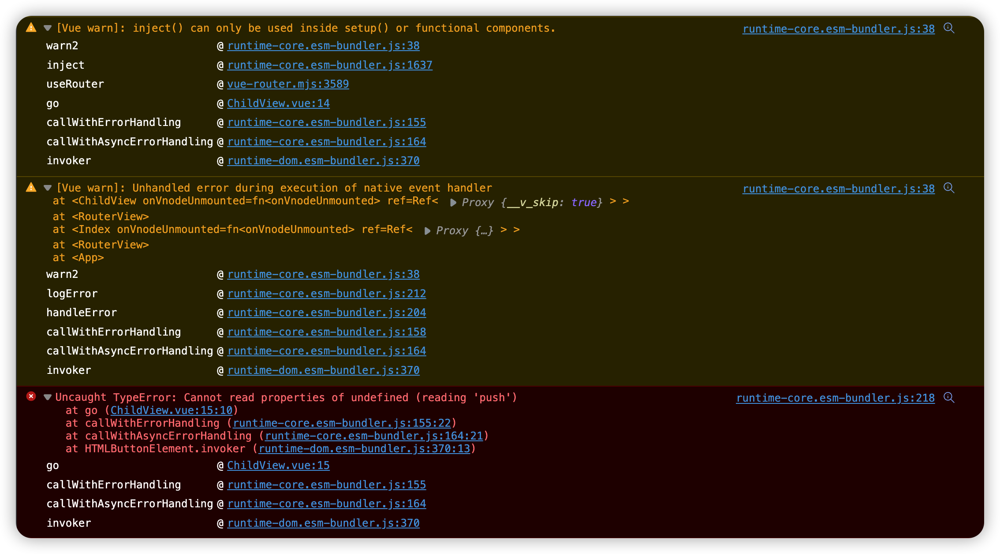

## Summary

When Using `useRouter` in `<script setup>`

### Do

get router directly in setup

```HTML
<script setup>
const router = useRouter() // ✅

const innerScope = ()=>{
   router.push(/** */) // navigation success
}
<script>
```

### Do not

get router in innerScope

```HTML
<script setup>

const innerScope = ()=>{
   const router = useRouter() // ❌
   router.push(/** */) // navigation failure
}
<script>
```

---

> Problem solved by https://discord.com/channels/325477692906536972/325479452773580800/1022014399524900914

## Description

Fail to navigate to other route by using `useRouter().push` in nested route

## Setup

local

```bash
pnpm i
npm run dev
```

or you can use [online demo on stackblitz](https://stackblitz.com/github/HenryC-3/reproduce-vue_router_push_faliure)

## Reproduce

1. go to the route `/about/child`
2. click the test button, which suppose to trigger navigation and goes to `/`
3. no navigation triggered, and console prints out following messages.
   

## Index

- the test button logic: [ChildView.vue](./src/views/AboutView/ChildView.vue)
- the router: [index.js](./src/router/index.js)
- [online demo on stackblitz](https://stackblitz.com/github/HenryC-3/reproduce-vue_router_push_faliure)
